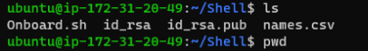
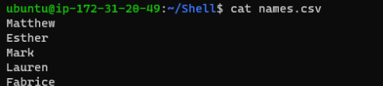

# SHELL SCRIPTING

In this project, I will onboard 20 new Linux users onto a server. Create a shell script that reads a csv file that contains the first name of the users to be onboarded.

I created a shell script and then created Onboard.sh file within my ubuntu server. The script was copied into this file.

Onboard.sh file was moved to a directory named 'Shell' and files id.rsa id.rsa.pub names.csv created 

id.rsa was populated with private key. id.rsa.pub populated with public key 

I then added 20 names to the names.csv file 

*Screenshot below*

                                                  
Run following command to create developers group: sudo groupadd developers

*screenshot below (after switching to root user)*

Run this command to make the .sh file executable: sudo chmod +x Onboard.sh

Switched to super user with command: sudo su

Run the script with command: ./Onboard.sh
