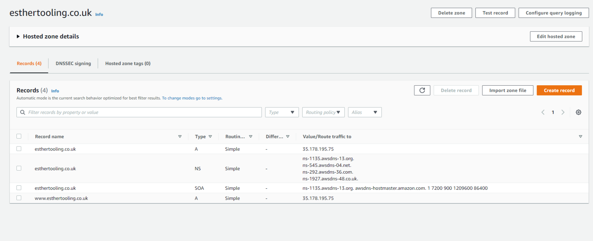
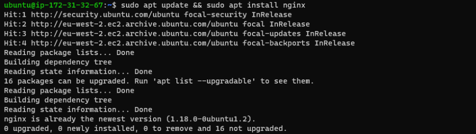
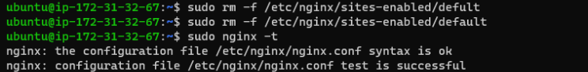
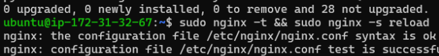

# __LOAD BALANCER SOLUTION WITH NGINX AND SSL/TLS__

During this project I will do the following:

1. Register a new domain name and connect to route 53
1. Configur Nginx as a Load Balancer

## Register a new domain name and connect to route 53

I registered a www.esthertooling.co.uk on go daddy. I then went unto the route 53 dashboard on AWS and created a hosted zone, connected this to my domain. This will tell route 53 to respond to DNS queries for my domain.  

*screenshot below*



## Configure Nginx As A Load Balancer

In order to do this I completed the following:

1. Created an EC2 VM based on Ubuntu Server 20.04 LTS and opened TCP port 80 for HTTP connections and TCP port 443

1. Updated /etc/hosts file for local DNS with Web Servers’ names (e.g. Web1 and Web2) and their local IP addresses

1. Installed and configured Nginx as a load balancer to point traffic to the resolvable DNS names of the webservers

To update the server depositery and install nginx I executed this command:

```
sudo apt update && sudo apt install nginx
```

*screenshot below*



In order to Configure Nginx LB using Web Servers’ names defined in  /etc/hosts I created a config file by executing the below command:

sudo vi /etc/nginx/sites-available/load_balancer.conf  

The confiuration below was inserted and saved 

```
upstream web {
    server <Private ip address>;
    server <private ip address>;
  }

server {
    listen 80;
    server_name esthertooling.co.uk www.esthertooling.co.uk;
    location / {
      proxy_pass http://web;
    }
  }

  ```

Removed default site so reverse proxy will be redirected to the new configuration file 

sudo rm -f /etc/nginx/sites-enabled/default

checked that nginx was successfully configured with this command: 

```
sudo nginx -t
```
*screenshot below*



linked my load balancer config file created in sites available to sites enabled so that nginx can access the configuration file

```
cd /etc/nginx/sites-enabled 

sudo ln -s ../sites-available/load_balancer.conf . 
```
*screenshot below*


                                                            


  ## configure secured connection using SSL/certificates                                                      

I installed certbot and dependencies by executing the following command: 

```
sudo apt install certbot -y

sudo apt install python3-certbot-nginx -y

```

executed the below commands to checked syntax and reload nginx:

```
sudo nginx -t && sudo nginx -s reload
```

*Screenshot below*

*screenshot below*




In order to create a certificate for my domain to make it secure I executed this command 

```
sudo certbot --nginx -d esthertooling.co.uk -d www.esthertooling.co.uk
```

A valid email address was entered and service agreement accepted. To increase security I selected for incoming request from port 80 to be redirected to port 443.

*screenshot below showing site is secure*

*screenshot below*


created a cron assignment so that the certificate will automatically renew each time it expires by executing this command:

```
crontab -e
```
Inserted the below command which will be executed every 12 minutes of every hour:

```
* */12 * * *   root /usr/bin/certbot renew > /dev/null 2>&1
```
