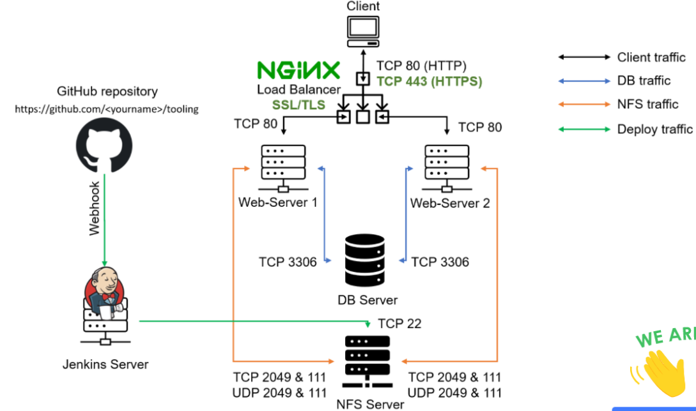

# __LOAD BALANCER SOLUTION WITH NGINX AND SSL/TLS__

During this project we will do the following:

1. Register a new domain name and connect to route 53
1. Configure Nginx as a Load Balancer




## Configure Nginx As A Load Balancer

In order to do this complete the following:

1. Create an EC2 VM based on Ubuntu Server 20.04 LTS and open TCP port 80 for HTTP connections and TCP port 443

1. Update /etc/hosts file for local DNS with Web Servers’ names (e.g. Web1 and Web2) and their local IP addresses

```
<IP web 1>

<IP web 2>
```

Update the server repositry and install nginx:

```
sudo apt update && sudo apt install nginx
```

*screenshot below*


- In order to Configure Nginx LB using Web Servers’ names defined in  /etc/hosts  created a config file by executing the below command:

```
sudo vi /etc/nginx/nginx.conf 
```

- Insert and save the configuration below 

```
upstream web {
    server <Private ip address>;
    server <private ip address>;
  }

server {
    listen 80;
    server_name esthertooling.co.uk www.esthertooling.co.uk;
    location / {
      proxy_pass http://web;
    }
  }

  ```


- Check that nginx was successfully configured:

```
sudo nginx -t
```

*screenshot below*


- Restart Nginx and make sure the service is up 

```
sudo systemctl restart nginx

 sudo systemctl status nginx.
```


                                                        
## Register a new domain name and connect to route 53

- Register a doman with any registrar of your choice
- Go unto the route 53 dashboard on AWS and create a hosted zone, connect this to your domain. This will tell route 53 to respond to DNS queries from your domain.  
- Assign an Elastic IP to your Nginx LB server and associate the domain name with this Elastic IP, the purpose of this is to ensure that the public IP address is static because everytime you restart, stop or start your EC2 instance, you get a new public IP address. When you want to associate your domain name, it is better to have a static IP address that does not change after reboot, thus Elastic IP is the solution for this problem.

*screenshot below*


  ## configure secured connection using SSL/certificates                                                      

- I install certbot and dependencies by executing the following command: 

```
sudo apt install certbot -y

sudo apt install python3-certbot-nginx -y

```

- execut the below commands to checked syntax and reload nginx:

```
sudo nginx -t && sudo nginx -s reload

#Make sure snap service is running 
sudo systemctl status snapd
```

*screenshot below*


- Create a certificate for your domain to make it is secure:

```
sudo certbot --nginx -d esthertooling.co.uk -d www.esthertooling.co.uk
```

- Enter a valid agreement and accept service agreement. To increase security select for incoming request from port 80 to be redirected to port 443.

*screenshot below showing site is secure*


- Create a cron assignment so that the certificate will automatically renew each time it expires by executing this command:

```
crontab -e
```

Insert the below command which will be executed every 12 minutes of every hour:


```
* */12 * * *   root /usr/bin/certbot renew > /dev/null 2>&1
```

- Set up periodical renewal of your SSL/TLS certificate. By default, LetsEncrypt certificate is valid for 90 days, so it is recommended to renew it at least every 60 days or more frequently.


You can test renewal command in dry-run mode

```
sudo certbot renew --dry-run
```

The best practice is to have a scheduled job to run renew command periodically. Add the following command

```
* */12 * * * root /usr/bin/certbot renew > /dev/null 2>&1.
```


