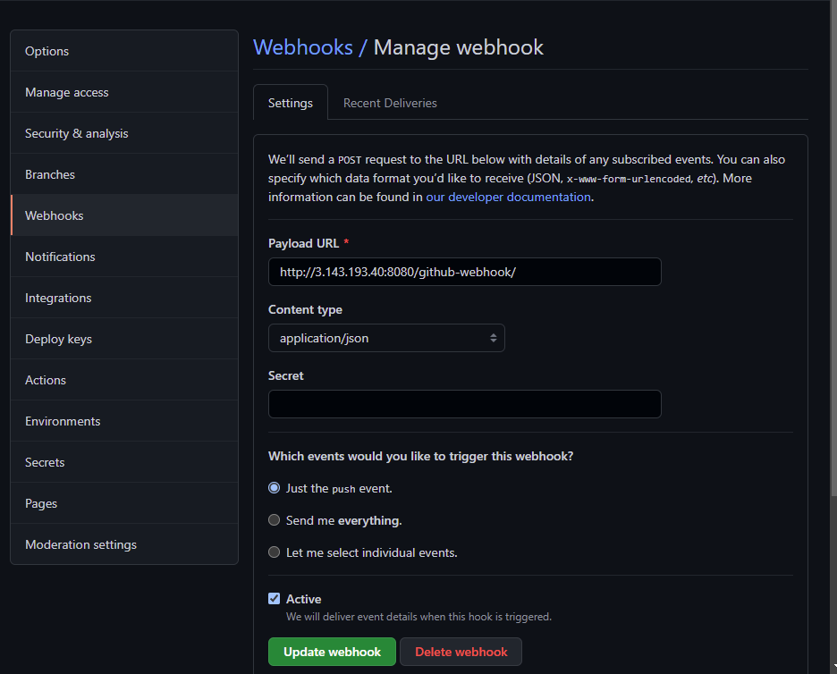

# __ANSIBLE AUTOMATION PROJECT__

- Project 7-10 consisted of manual operations for setting up virtual servers, installing and configuring required softwares.
- The aim of this project is to automate most of the tasks with Ansible Configuration Management.

## INSTALL AND CONFIGURE ANSIBLE ON EC2 INSTANCE

- Install Ansible 

```
sudo apt update

sudo apt install ansible

ansible --version
```


- Update the name tag on your Jenkins EC2 Instance to Jenkins-Ansible, it is the server that will be used to run the playbook.

- create a new repository within your github account and name this ansible-config.

- Create a new freestyle project called "ansible" in Jenkins. Point it to the "ansible-config" repository and configure a Post-build job to save all (**) files

*screenshot below*


- Configure Webhook and set webhook to trigger ansible build.





- Test your setup by making some changes in the README.MD file in master branch and make sure that  builds starts automatically and that Jenkins saved the files (build artifacts) in following folder

```
ls /var/lib/jenkins/jobs/ansible/builds/<build_number>/archive/
```

*screenshot below*


### Prepare the development environment using Visual Studio Code

- Configure an IDE (VCS) to connect to the ansible config respository

- install remote development pack on VSCODE

- clone the repositry into VSCODE 


## BEGIN ANSIBLE DEVELOPMENT

- Create a new branch that will be used for development of a new feature

```
git checkout -b prj-11
```

- Create a 'playbooks' and 'inventory' directory 
- Within the playbooks directory create a playbook (common.yml). 
- Within the inventory file create a file for each development stage (Development, Staging Testing and Production)

### Set up an Ansible Inventory

 - Ansible uses TCP port 22 by default, which means it needs to ssh into target servers from Jenkins-Ansible host.

 - In order to achieve this install ssh agent 

```
Get-Service ssh-agent | Set-Service -StartupType Automatic -PassThru | Start-Service
```

- Add the path to the private key

```
ssh-add <path to the key>
```

*Screenshot below*


- ssh'd into the Jenkins-Ansible server using ssh-agent

```
ssh -A ubuntu@<public-ip>
```

- Check that you are able to connect to your RHEL and ubuntu target servers:

```
ssh ec2-user@<privateipaddress>

ssh ubuntu@<privateipadress>
```


- Update inventory/dev.yml file with the code below:

```
[nfs]
<NFS-Server-Private-IP-Address> ansible_ssh_user='ec2-user'

[webservers]
<Web-Server1-Private-IP-Address> ansible_ssh_user='ec2-user'
<Web-Server2-Private-IP-Address> ansible_ssh_user='ec2-user'

[db]
<Database-Private-IP-Address> ansible_ssh_user='ec2-user' 

[lb]
<Load-Balancer-Private-IP-Address> ansible_ssh_user='ubuntu'
```


## CREATE A COMMON PLAYBOOK

 - The below playbook is divided into two parts, each of them is intended to perform the same task: install wireshark utility (or make sure it is updated to the latest version) on the RHEL 8 and Ubuntu servers. It uses root user to perform this task and respective package manager: yum for RHEL 8 and apt for Ubuntu.

 
```
 - name: update web, nfs and db servers
  hosts: webservers, nfs, db
  remote_user: ec2-user
  become: yes
  become_user: root
  tasks:
    - name: ensure wireshark is at the latest version
      yum:
        name: wireshark
        state: latest

- name: update LB server
  hosts: lb
  remote_user: ubuntu
  become: yes
  become_user: root
  tasks:
    - name: Update apt repo
      apt: 
        update_cache: yes

    - name: ensure wireshark is at the latest version
      apt:
        name: wireshark
        state: latest

```

### Update GIT with the latest code

- To Commit the code into GitHub execute the below command and make a pull request:

```
git status

git add <selected files>

git commit -m "commit message"


```


- Verify that all artifacts are saved within the jenkin-ansible server:

```
/var/lib/jenkins/jobs/ansible/builds/<build_number>/archive/
```

*screenshot below*


## RUN FIRST ANSIBLE TEST

Update config file with below code and connect to ansible via ssh on vscode terminal

```
Host jenkins_ansible
    Host name <Public ip>
    User ubuntu
    IdentityFile <path to pem>
    ForwardAgent yes
    ControlPath /tmp/ansible-ssh-%h-%p_%r
    ControlMaster auto
    ControlPersist 10m
```
   
   
- Open the ansible directory into vscode.


- Run the ansible-playbook command 

```
ansible-playbook -i /var/lib/jenkins/jobs/ansible/builds/5/archive/inventory/dev.yml /var/lib/jenkins/jobs/ansible/builds/5/archive/playbooks/common.yml
```

- Verify  that wireshark has been on all servers:

```
which wireshark
```


