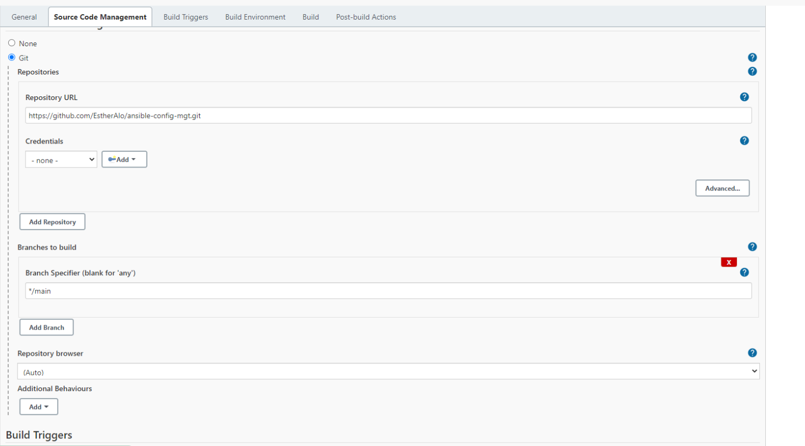
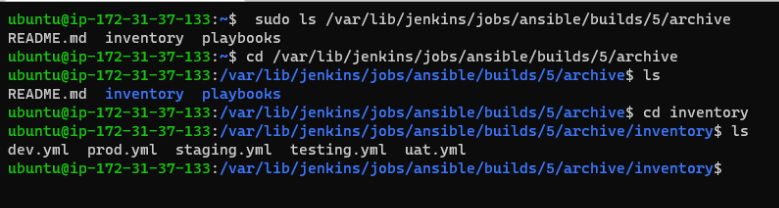
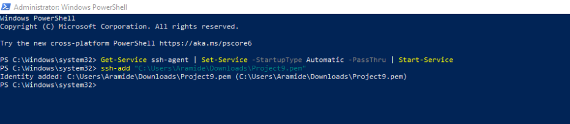
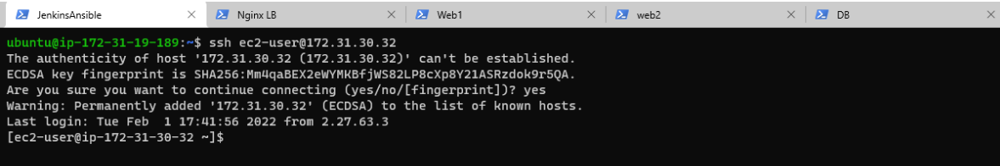
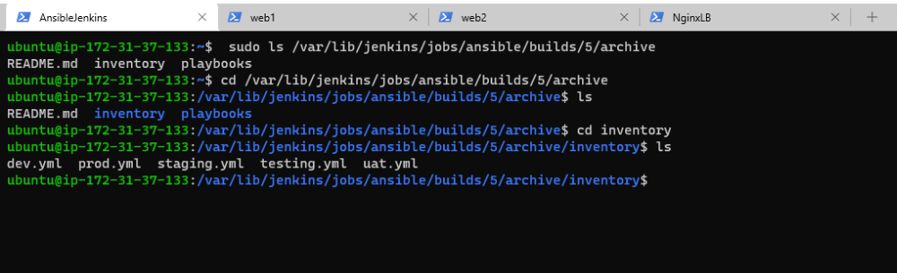
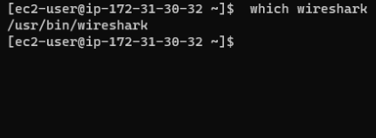

# __ANSIBLE AUTOMATION PROJECT__

- Project 7-10 consisted of manual operations for setting up virtual servers, installing and configuring required softwares.
The aim of this project is to automate most of the tasks with Ansible Configuration Management.

## INSTALL AND CONFIGURE ANSIBLE ON EC2 INSTANCE

- Ansible was installed unto my Jenkins server and Ansible version was checked with the below command:

```
sudo apt update

sudo apt install ansible

ansible --version
```


- Updated the name tag on our Jenkins EC2 Instance to Jenkins-Ansible, it is the server that will be used to run the playbook.

- created a new repository within my github account and named this ansible-config.

- Created a new freestyle project called "ansible" in Jenkins and pointed it to the "ansible-config" repository and configured a Post-build job to save all (**) files

*screenshot below*



- Configured Webhook and set webhook to trigger ansible build.

- Jenkins was configured to build each time content within the repository was commited


Tested my setup by making some change in README.MD file in master branch and made sure that  builds starts automatically and that Jenkins saved the files (build artifacts) in following folder

```
ls /var/lib/jenkins/jobs/ansible/builds/<build_number>/archive/
```

*screenshot below*




### Prepare my development environment using Visual Studio Code

- I configured an IDE (VCS) to connect to my ansible config respository

- installed remote development pack on VSCODE

- cloned my repositry into VSCODE 


## BEGIN ANSIBLE DEVELOPMENT

- The below command was executed within vsc in order to create a new branch that will be used for development of a new feature

```
git checkout -b prj-11
```

Created a 'playbooks' and 'inventory' directory and within the playbooks directory I created a playbook (common.yml). Within the inventory file I created a file for each development stage (Development, Staging Testing and Production)

### Set up an Ansible Inventory

 - Ansible uses TCP port 22 by default, which means it needs to ssh into target servers from Jenkins-Ansible host.

 - In order to achieve this I  executed below command into the admin terminal which only needs to be done once

```
Get-Service ssh-agent | Set-Service -StartupType Automatic -PassThru | Start-Service


ssh-add <path to the key>
```

*Screenshot below*



- I then ssh'd into the Jenkins-Ansible server using ssh-agent

```
ssh -A ubuntu@<public-ip>
```

- To check that I was able to connect to my RHEL and ubuntu target servers I executed the following commands

```
ssh ec2-user@<privateipaddress>

ssh ubuntu@<privateipadress>
```

*Screenshot showing I was able to ssh into my webserver*


- The inventory/dev.yml file was updated with the code below:


```
[nfs]
<NFS-Server-Private-IP-Address> ansible_ssh_user='ec2-user'

[webservers]
<Web-Server1-Private-IP-Address> ansible_ssh_user='ec2-user'
<Web-Server2-Private-IP-Address> ansible_ssh_user='ec2-user'

[db]
<Database-Private-IP-Address> ansible_ssh_user='ec2-user' 

[lb]
<Load-Balancer-Private-IP-Address> ansible_ssh_user='ubuntu'
```


## CREATE A COMMON PLAYBOOK

 - The below playbook is divided into two parts, each of them is intended to perform the same task: install wireshark utility (or make sure it is updated to the latest version) on my RHEL 8 and Ubuntu servers. It uses root user to perform this task and respective package manager: yum for RHEL 8 and apt for Ubuntu.

 
```
 - name: update web, nfs and db servers
  hosts: webservers, nfs, db
  remote_user: ec2-user
  become: yes
  become_user: root
  tasks:
    - name: ensure wireshark is at the latest version
      yum:
        name: wireshark
        state: latest

- name: update LB server
  hosts: lb
  remote_user: ubuntu
  become: yes
  become_user: root
  tasks:
    - name: Update apt repo
      apt: 
        update_cache: yes

    - name: ensure wireshark is at the latest version
      apt:
        name: wireshark
        state: latest

```

### Update GIT with the latest code

- To Commit the code into GitHub I executed the below command and made a pull request:

```
git status

git add <selected files>

git commit -m "commit message"


```

*Screenshot showing pull request successful*

- To verifiy that all artifacts were saved within my jenkin-ansible I executed the below commad:

```
/var/lib/jenkins/jobs/ansible/builds/<build_number>/archive/
```

*screenshot below*




## RUN FIRST ANSIBLE TEST

Updated config file with below code and connected to ansible via ssh on vscode 

```
Host jenkins_ansible
    Host name <Public ip>
    User ubuntu
    IdentityFile <path to pem>
    ForwardAgent yes
    ControlPath /tmp/ansible-ssh-%h-%p_%r
    ControlMaster auto
    ControlPersist 10m
```
   
   
- Opened the ansible directory into vscode.


- To execute ansible-playbook command and verify that the playbook works I executed the below command. 

```
ansible-playbook -i /var/lib/jenkins/jobs/ansible/builds/5/archive/inventory/dev.yml /var/lib/jenkins/jobs/ansible/builds/5/archive/playbooks/common.yml
```

- To verify on each server that wireshark was installed I executed the below command:

```
which wireshark
```




