# __ANSIBLE REFACTORING AND STATIC ASSIGNMENTS (IMPORTS AND ROLES)__

- In this project I continued working with my ansible-config-mgt repository and made some improvements to my code. 
- I refactored the Ansible code, created assignments, and used the imports functionality. Imports allow to effectively re-use previously created playbooks in a new playbook – it allows you to organize your tasks and reuse them when needed.


## Jenkins job enhancement

 - New change in the codes creates a separate directory which is not very convenient when we want to run some commands from one place. This consumes space on Jenkins serves with each subsequent change.


- I created  a new directory called ansible-config-artifact –  all artifacts will be stored here after each build.

```
sudo mkdir /home/ubuntu/ansible-config-artifact
```

- Changed permissions to this directory, so Jenkins could save files there:

```
chmod -R 0777 /home/ubuntu/ansible-config-artifact
```

- Went to the Jenkins web console -> Manage Jenkins -> Manage Plugins -> and on Available tab searched for Copy Artifact and installed this plugin without restarting Jenkins

*screenshot below* 

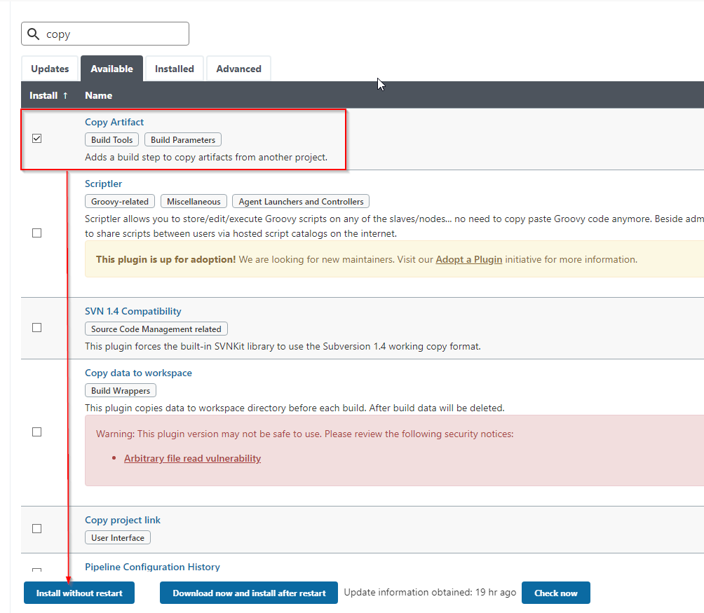

- Created a new Freestyle project and named it save_artifacts. This project will be triggered by completion of the existing ansible project. 

*screenshot below* 2


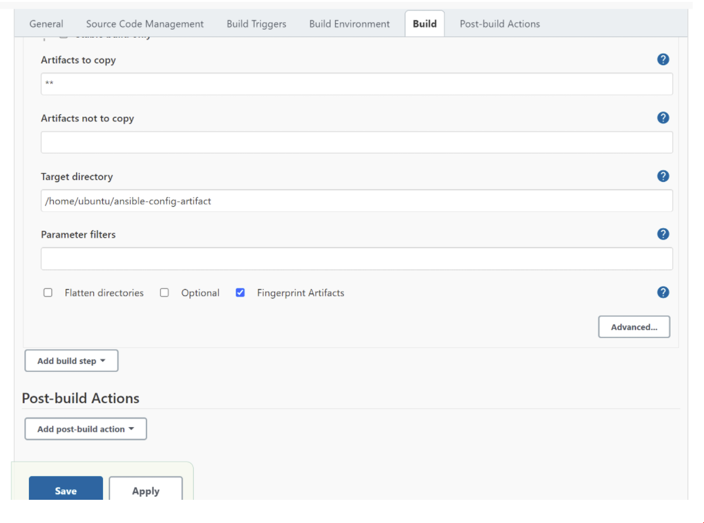

- The main idea of save_artifacts project is to save artifacts into /home/ubuntu/ansible-config-artifact directory. To achieve this, I created a Build step and chose Copy artifacts from other project, specified ansible as a source project and /home/ubuntu/ansible-config-artifact as a target directory.

- Tested my set up by making some change in README.MD file inside the ansible-config repository (right inside master branch).

*screenshot showing build was made in saved_artifacts*

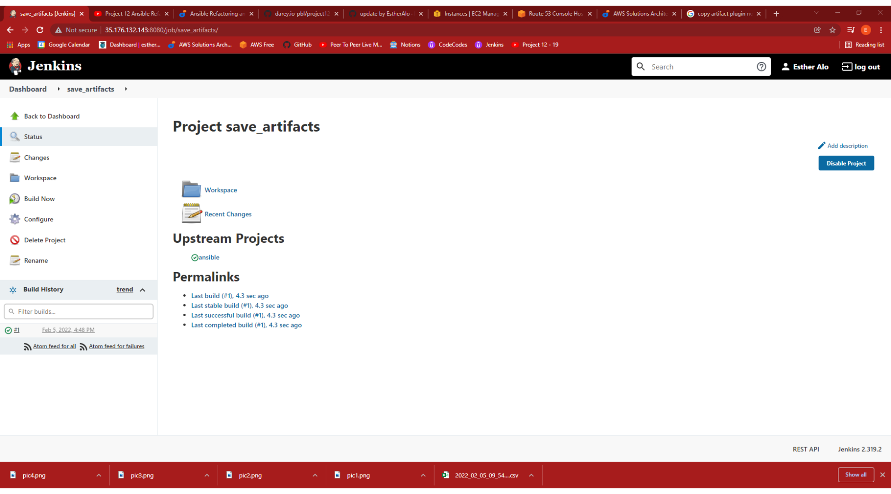

## Refactor Ansible Code By Importing Other Playbooks Into site.yml

- Created a folder named ansible on my jenkins-Ansible server and cd into it:

```
mkdir ansible && cd ansible.
```

Cloned the ansible-config repository into the ansible folder 

```
git clone https://github.com/EstherAlo/ansible-config-mgt.git
```

- On my vscode editer, Within playbooks folder, I created a new file and named it site.yml – This file will now be considered as an entry point into the entire infrastructure configuration. Other playbooks will be included here as a reference. site.yml will become a parent to all other playbooks that will be developed.

- Created a new folder in root of the repository and named it static-assignments. The static-assignments folder is where all other children playbooks will be stored. This is merely for easy organization of my work. 

- The code below uses built in import_playbook Ansible module. This code was placed in the sites.yml file and tell ansible to to import from static assignment/common.yml file

```
---
- hosts: all
- import_playbook: ../static-assignments/common.yml
```

- This what the  folder structure looks like:

*screenshot below*

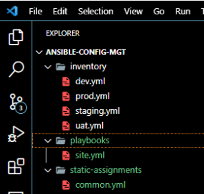

(add more information here )


In /etc/ansible/ansible.cfg file uncomment inventory string and provided a full path to the inventory directory = /home/ubuntu/ansible/ansible-config/inventory, so Ansible could know where to find configured roles.


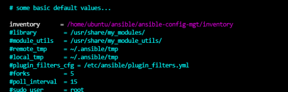

- updated site.yml with import_playbook: ../static-assignments/common-del.yml instead of common.yml and excuted the below command against the dev servers

```
sudo ansible-playbook -i /home/ubuntu/ansible-config-mgt/inventory/dev.yml /home/ubuntu/ansible-config-mgt/playbooks/site.yml
```
*screenshot below*

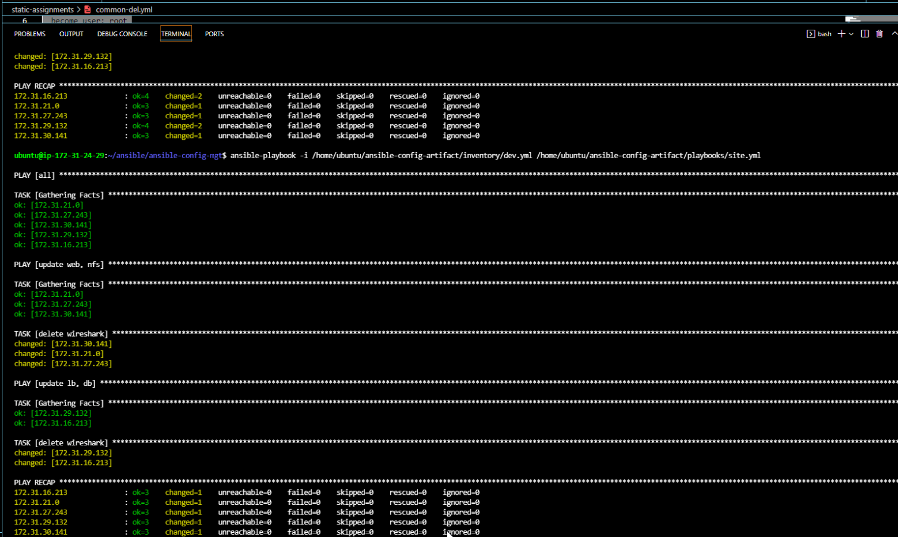
## CONFIGURE UAT WEBSERVERS WITH A ROLE ‘WEBSERVER’

- Launched 2 EC2 instances using RHEL 8 image, this was used as the uat servers, and were named – Web1-UAT and Web2-UAT.

- I created a role directory within my ansible_config_mgt directory. The role directory must be relative to the playbook file or in /etc/ansible/ directory


 - The roles structure should look like this.

 *Screenshot below*

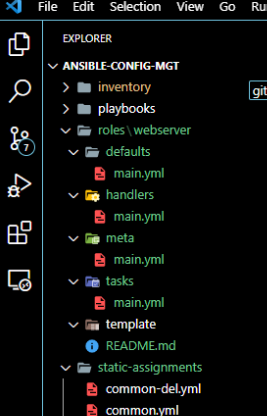

- Updated the inventory ansible-config/inventory/uat.yml file with IP addresses of the 2 UAT Webservers.

*screenshot below*


- In /etc/ansible/ansible.cfg file uncommented roles_path string and provided a full path to my roles directory roles_path = /home/ubuntu/ansible-config-mgt/roles, so Ansible will know where to find configured roles.

*screenshot below*

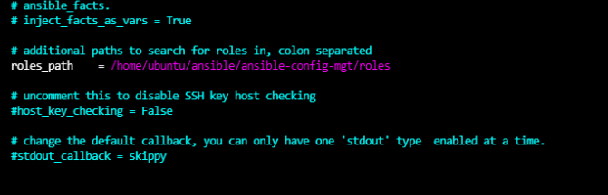


- Went into the tasks directory, and within the main.yml file, wrote configuration tasks to do the following: 


1. install and configure Apache (httpd service) 
1. Clone Tooling website from GitHub https://github.com/EstherAlo/tooling.git. 
1. Ensure the tooling website code is deployed to /var/www/html on each of 2 UAT Web servers. 
1. Make sure httpd service is started.


*screenshot below*
 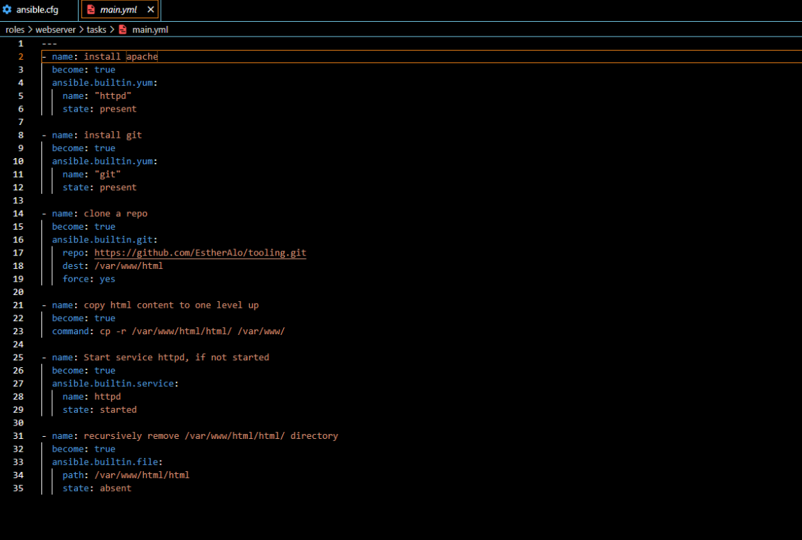


## Reference ‘Webserver’ role
- Within the static-assignments folder, created a new assignment for uat-webservers uat-webservers.yml. This is where I will reference the role.

*screenshot below*

 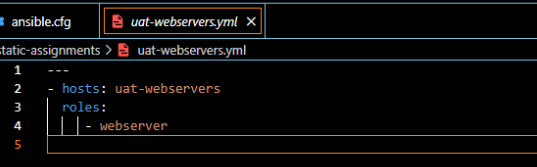

## Commit & Test

 - Committed my changes, created a Pull Request and merged them to master (main) branch, made sure webhook triggered two consequent Jenkins jobs, then ran successfully and copied all the files to your Jenkins-Ansible server into /home/ubuntu/ansible/ansible-config/ directory.

- Executed the playbook against the uat inventory.

```
ansible-playbook -i /home/ubuntu/ansible-config-mgt/inventory/uat.yml /home/ubuntu/ansible-config-mgt/playbooks/site.yml
```

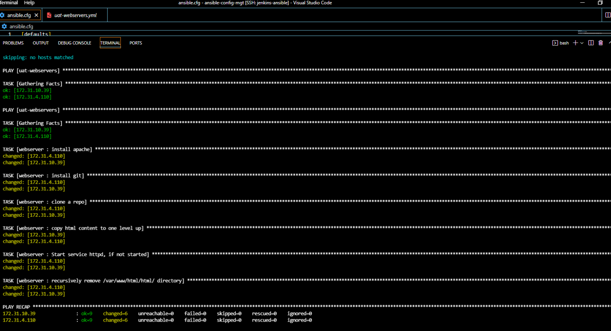

I WAS able to see both of the UAT Web servers configured and able reach them from the browser: 

*screenshot below*
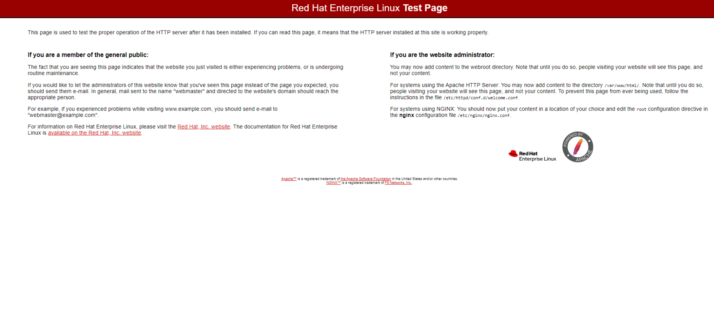


*screenshot of Ansible architecture*

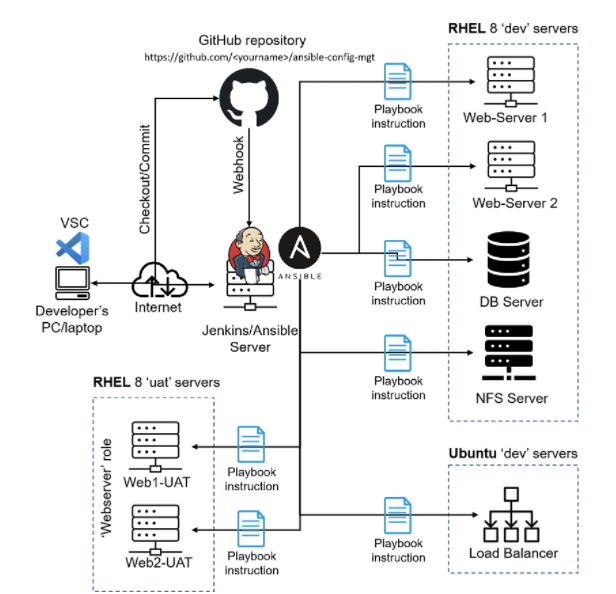
