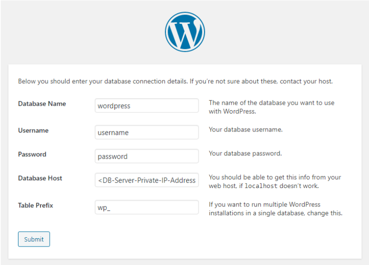

# Project Web Solution With WordPress

The aim of this project was prepare storage infrastructure on two Linux servers and implement a basic web solution using WordPress

Project 6 consists of two parts:

1. Configure storage subsystem for Web and Database servers based on Linux OS. 
1. Install WordPress and connect it to a remote MySQL database server.

## LAUNCH AN EC2 INSTANCE THAT WILL SERVE AS “WEB SERVER”

### Preparing a Web Server

Launched an EC2 instance that will serve as "Web Server" and attached three volumes. To inspect what block devices are attached to the server I Used the this command: lsblk 

*screenshot below*


To see all mounts and free space on the server I used the following command: 

 df -h 

*Screenshot below*


I used gdisk utility to create a single partition on each of the 3 disks and then to view the newly configured partition on each of the 3 disks the lsblk command: 

*Screenshot below*


I run the following command to install lvm2: sudo yum install lvm2

Used pvcreate utility to mark each of 3 disks as physical volumes (PVs) to be used by LVM and verified that the physical volumes has been created successfully

```
sudo pvcreate /dev/xvdf1
sudo pvcreate /dev/xvdg1
sudo pvcreate /dev/xvdh1
```

*screenshot below*


To add all 3 PVs to a volume group (VG) I run the following command:

```
sudo vgcreate webdata-vg /dev/xvdh1 /dev/xvdg1 /dev/xvdf1
```
                                                                
Verification that the VG has been created successfully by running:

```
sudo vgs
```

*screenshot below*


I created 2 logical volumes. apps-lv, and logs-lv. apps-lv will be used to store data for the Website while, logs-lv will be used to store data for logs

```
sudo lvcreate -n apps-lv -L 14G webdata-vg
sudo lvcreate -n logs-lv -L 14G webdata-vg
```

I verfied that the Logical Volume had been created successfully by running: 

```
sudo lvs
```

*screenshot below*


To confirm the whole set up I ran the following commands:

```
sudo vgdisplay -v #view complete setup - VG, PV, and LV

sudo lsblk 
```
*Screenshot below*


I used mkfs.ext4 to format the logical volumes with ext4 filesystem with the commands below: 

```
sudo mkfs -t ext4 /dev/webdata-vg/apps-lv
sudo mkfs -t ext4 /dev/webdata-vg/logs-lv
```

To create a directory to store website files and also mount this i run the following comand:

```
sudo mkdir -p /var/www/html

sudo mount /dev/webdata-vg/apps-lv /var/www/html/
```

I then created a directory to store backup log data with the below command: 

```
sudo mkdir -p /home/recovery/logs
```

Before mounting the fie system I backedup all the files in the log directory /var/log into /home/recovery/logs by running this command:

```
sudo rsync -av /var/log/. /home/recovery/logs/
```

## UPDATE THE `/ETC/FSTAB` FILE

The UUID of the device was used to update the /etc/fstab file. I used the below command to retrieve this and then updated the fstab file rememebering to remove the leading and ending quotes.

```
sudo blk id
```

*screenshot below*


To Test the configuration and reload the daemon I run command: 

```
 sudo mount -a
 sudo systemctl daemon-reload
 ```

                            
To verify the setup I ran command: df -h


### Preparing the Database Server

I Launched a second RedHat EC2 instance that has the role – ‘DB Server’
Repeated the same steps as for the Web Server, but instead of apps-lv I created db-lv and mounted it to /db directory instead of /var/www/html/

*Screenshot below*


Installing WordPress on your Web Server EC2

Updated the repositoryand installed wget, Apache and it’s dependencies

```
sudo yum -y update

sudo yum -y install wget httpd php php-mysqlnd php-fpm php-json
```

Started and enabled Apache by running this command:

```
sudo systemctl enable httpd
sudo systemctl start httpd
```

To install PHP and it’s depemdencies I run the commands below:

```
sudo yum install https://dl.fedoraproject.org/pub/epel/epel-release-latest-8.noarch.rpm
sudo yum install yum-utils http://rpms.remirepo.net/enterprise/remi-release-8.rpm
sudo yum module list php
sudo yum module reset php
sudo yum module enable php:remi-7.4
sudo yum install php php-opcache php-gd php-curl php-mysqlnd
sudo systemctl start php-fpm
sudo systemctl enable php-fpm
setsebool -P httpd_execmem 1
```

Restarted Apache with the following command: 

```
sudo systemctl restart httpd
```

To download wordpress and copy wordpress to var/www/html the below commands were entered:

```
  mkdir wordpress
  cd   wordpress
  sudo wget http://wordpress.org/latest.tar.gz
  sudo tar xzvf latest.tar.gz
  sudo rm -rf latest.tar.gz
  cp wordpress/wp-config-sample.php wordpress/wp-config.php
  cp -R wordpress /var/www/html/
  ```

Configured SELinux Policies by running the following commands:

```
  sudo chown -R apache:apache /var/www/html/wordpress
  sudo chcon -t httpd_sys_rw_content_t /var/www/html/wordpress -R
  sudo setsebool -P httpd_can_network_connect=1
```

Installing MySQL on your DB Server EC2

I updated the repositries and installed MySqlserver

```
sudo yum update
sudo yum install mysql-server
```

Verified that the service is up and running by using this command:

```
sudo systemctl status mysqld
```

### Configured DB to work with WordPress

I did the following:

- Created the database
- Created the user
- Created the password for te user
- Granted and flushed prvileges

*Screenshot below*


### Configured WordPress to connect to remote database


To allow wordpress to connect to the database it was necessary to open MySQL port 3306 on DB Server EC2. For extra security, I only allowed access to the DB server only from my Web Server’s IP address, so in the Inbound Rule configuration I specified source as /32


To install MySQL client and test that I can connect from my Web Server to the DB server I ran this command:

```
sudo yum install mysql
sudo mysql -u admin -p -h <DB-Server-Private-IP-address>
```

Verified if I can successfully execute SHOW DATABASES; command and see a list of existing databases

*screenshot below*


Changed permissions and configuration so Apache could use WordPress and enabled TCP port 80 in Inbound Rules configuration for the Web Server EC2


Accessed wordpress using my browser link:

*Screenshot below*


*Filled in my credentials*



My WordPress has successfully connected to my remote MySQL database!

*Screenshot below*


