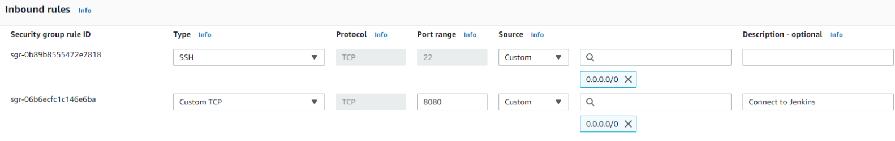
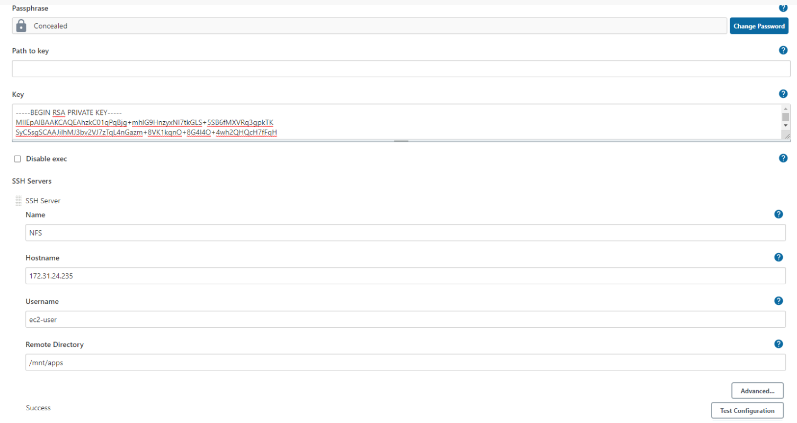

## __CONTINUOUS INTERGRATION PIPELINE FOR TOOLING WEBSITE__

- The task of this project is to enhance the architecture prepared in Project 8 by automating part of our routine tasks with a free and open source automation server (Jenkins)
- Acording to Circle CI, Continuous integration (CI) is a software development strategy that increases the speed of development while ensuring the quality of the code that teams deploy. Developers continually commit code in small increments (at least daily, or even several times a day), which is then automatically built and tested before it is merged with the shared repository.

- In our project we are going to utilize Jenkins CI capabilities to make sure that every change made to the source code in GitHub

- Here is how your updated architecture will look like upon competion of this project:


## Install Jenkins server

- Spin up an AWS EC2 server based on Ubuntu Server 20.04 LTS and name it "Jenkins". 

- Install JDK (since Jenkins is a Java-based application)

```
sudo apt update
sudo apt install default-jdk-headless
```

- Install Jenkins 

```
wget -q -O - https://pkg.jenkins.io/debian-stable/jenkins.io.key | sudo apt-key add -
sudo sh -c 'echo deb https://pkg.jenkins.io/debian-stable binary/ > \
    /etc/apt/sources.list.d/jenkins.list'
```

Confirm Jenkins is up and running:

```
sudo systemctl status jenkins
```

- Jenkins default server uses TCP port 8080 so create a new Inbound in the EC2 Security Group

*Screenshot below*



- I accessed Jenkins with the servers public ip via your

- You will be prompted to provide a default admin password. retriev this by running this command:

```
sudo cat /var/lib/jenkins/secrets/initialAdminPassword
```

- Install suggested plugins and an create a user.

## Configure Jenkins to retrieve source codes from GitHub using Webhooks

- In this part, you will learn how to configure a simple Jenkins job/project (these two terms can be used interchangeably). This job will will be triggered by GitHub webhooks and will execute a ‘build’ task to retrieve codes from GitHub and store it locally on Jenkins server.

- Enable webhooks in your GitHub repository settings

*insert image*

- Go to Jenkins web console, click “New Item” and create a “Freestyle project”.

- To connect your GitHub repository, you will need to provide its URL, you can copy from the repository itself

- In configuration of your Jenkins freestyle project choose Git repository, provide there the link to your Tooling GitHub repository and credentials (user/password) so Jenkins could access files in the repository and click save

*insert image*

- Save the configuration and click on 'build now'

*Screenshot below*


- In order for the build to run automatically add the following configurations:

 1. Add github repository details to 'source code management'
 1. Change the branch specifier to main
 1. select GitHub hook trigger for GITScm polling  
 1. post-build actions: archive all the files.

- To confirm whether a new build has been launched automatically (by webhook) and see its results – artifact, I make some change in the  README.MD file) and push the changes to the master branch. 

- The screenshot below shows that a new build has been launched automatically (by webhook) and you can see its results – artifacts, saved on Jenkins server.


- By default, the artifacts are stored in the below path on the Jenkins server locally 

```
/var/lib/jenkins/jobs/tooling_github/builds/<build_number>/archive/
```

## CONFIGURE JENKINS TO COPY FILES TO NFS SERVER VIA SSH

- The artifacts are saved locally on Jenkins server, the next step is to copy them to our NFS server to /mnt/apps directory.

- Install "Publish Over SSH" plugin" from the Manage Jenkins and select Manage Plugins under System Configuration.




- Configure the job/project to copy artifacts over to NFS server. On main dashboard select “Manage Jenkins” and choose “Configure System” menu item.

- Scroll down to Publish over SSH plugin configuration section and configure it to be able to connect to your NFS server.


- Save the configuration, open your Jenkins job/project configuration page and add another one “Post-build Action”.

*insert image*

- Configure it to send all files produced by the build into our previouslys define remote directory. In our case we want to copy all files and directories - so we use "**".

- If you want to apply some particular pattern to define which files to send - use this syntax

*insert images*

- Make changes in the README.MD file in the git account and confirm if it will sync along with jenkins and show in the NFS server


This command was executed in th NFS server to make sure that the files in /mnt/apps have been updated:

```
cat /mnt/apps/README.md
```


