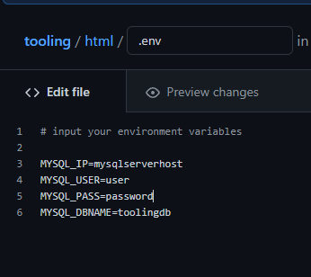

## __MIGRATION TO THE СLOUD WITH CONTAINERIZATION. PART 1 – DOCKER__

In this project we will be installing Docker and prepare for migration to the Cloud. First, we need to install Docker Engine, which is a client-server application that contains:

- A server with a long-running daemon process dockerd.
- APIs that specify interfaces that programs can use to talk to and instruct the Docker daemon.
- A command-line interface (CLI) client docker.


Spin up a t2.medium Ubuntu instance

- Set up the repository

```
sudo apt-get update
sudo apt-get install \
  ca-certificates \
  curl \
  gnupg \
  lsb-release
```


- Add Docker’s official GPG key:

```
curl -fsSL https://download.docker.com/linux/ubuntu/gpg | sudo gpg --dearmor -o /usr/share/keyrings/docker-archive-keyring.gpg
```

- Set up stabel repository

```
echo \
  "deb [arch=$(dpkg --print-architecture) signed-by=/usr/share/keyrings/docker-archive-keyring.gpg] https://download.docker.com/linux/ubuntu \
  $(lsb_release -cs) stable" | sudo tee /etc/apt/sources.list.d/docker.list > /dev/null
```

- Install Docker Engine

```
sudo apt-get update
sudo apt-get install docker-ce docker-ce-cli containerd.io
```

- Install specific version of Docker

```
apt-cache madison docker-ce
```


Verify that Docker Engine is installed

```
sudo docker run hello-world
```


We will be using the Tooling web application we used in our previous projects, which is a PHP-based web solution backed by a MySQL database. let us migrate the Tooling Web Application from a VM-based solution into a containerized one

## Step 1: Pull MySQL Docker Image from Docker Hub Registry


- Pull the appropriate Docker image for MySQL

```
sudo docker pull mysql/mysql-server:latest
```

Step 2: Deploy the MySQL Container to your Docker Engine

- Now you have the image you can deploy a new MySQL container:

- Replace <container_name> with the name of your choice. If you do not provide a name, Docker will generate a random one

- Replace with your chosen password

```
docker run --name <container_name> -e MYSQL_ROOT_PASSWORD=<my-secret-pw> -d mysql/mysql-server:latest
```
- The -d option instructs Docker to run the container as a service in the background

- In the command above, we used the latest version tag. This tag may differ according to the image you downloaded


check to see if the MySQL container is running

```
sudo docker ps -a 
```


## Step 3: Connecting to the MySQL Docker Container

We will connect to the mysql container we have created with a second container as MySQL client. We do have the option of connecting to the container using a server.

- Create a network:

```
sudo docker network create --subnet=172.18.0.0/24 tooling_app_network
```


- Verify that this has been created:

```
sudo docker network ls
```

Creating a custom network is not necessary because even if we do not create a network, Docker will use the default network for all the containers you run. By default, the network we created above is of DRIVER Bridge. 

However there are use cases where this is necessary. For example, if there is a requirement to control the cidr range of the containers running the entire application stack, this will be an ideal situation to create a network and specify the --subnet

For clarity’s sake, we will create a network with a subnet dedicated for our project and use it for both MySQL and the application so that they can connect.

- Create an environment variable to store the root password

```
export MYSQL_PW=password
```

Pull the image and run the container, all in one command 

```
sudo docker run --network tooling_app_network -h mysqlserverhost --name=mysql-server -e MYSQL_ROOT_PASSWORD=$MYSQL_PW -d mysql/mysql-server:latest
```

Flags used: 

-d runs the container in detached mode
--network connects a container to a network
-h specifies a hostname

It is best practice not to connect to the MySQL server remotely using the root user. Therefore, we will create an SQL script that will create a user we can use to connect remotely.

- Create a file and name it create_user.sql:

```
sudo vi create_user.sql
```

Add the below:

```
USE mysql; CREATE USER 'user'@'localhost' IDENTIFIED BY 'password';
GRANT ALL ON *.* TO 'user'@'localhost';
```

- Run the script: 

```
sudo docker exec -i mysql-server mysql -uroot -p$MYSQL_PW < ./create_user.sql
```

If you see the below warning, it is acceptable to ignore:

```
mysql: [Warning] Using a password on the command line interface can be insecure
```

## Step 4: Connecting to the MySQL server from a second container running the MySQL client utility

- Run the MySQL Client Container

```
sudo docker run --network tooling_app_network --name mysql-client -it --rm mysql mysql -h mysqlserverhost -u -p
```

Flags used:

--name gives the container a name
-it runs in interactive mode and Allocate a pseudo-TTY
--rm automatically removes the container when it exits
--network connects a container to a network
-h a MySQL flag specifying the MySQL server Container hostname
-u user created from the SQL script
-p password specified for the user created from the SQL script


## Step 5: Prepare database schema

Now we need to prepare a database schema so that the Tooling application can connect to it.

1. Clone the Tooling-app repository

```
git clone https://github.com/darey-devops/tooling.git
```

2. On your terminal, export the location of the SQL file:

```
export tooling_db_schema=/home/ubuntu/tooling/html/tooling_db_schema.sql
```

3. Use the SQL script to create the database and prepare the schema. With the docker exec command, you can execute a command in a running container

```
docker exec -i mysql-server mysql -uroot -p$MYSQL_PW < $tooling_db_schema 
```

4. Edit the .env file in the tooling/html folder with your db credentials used in your create_user.sql.



5. Run the tooling Application 
- Containerization of an application starts with creation of a file with a special name - 'Dockerfile'
- This tells Docker how to pack your application into a container. 
- In this project, we will build your container from a pre-created Dockerfile.
- Ensure you are inside the folder that has the Dockerfile and build your container

```
docker build -t tooling:0.0.1 .
```

We specify a parameter -t, so that the image can be tagged tooling:0.0.1 . Also, you have to notice the . at the end. This is important as that tells Docker to locate the Dockerfile in the current directory you are running the command. Otherwise, you would need to specify the absolute path to the Dockerfile.

6. Run the container: 

```
docker run --network tooling_app_network -p 8085:80 -it tooling:0.0.1
```


